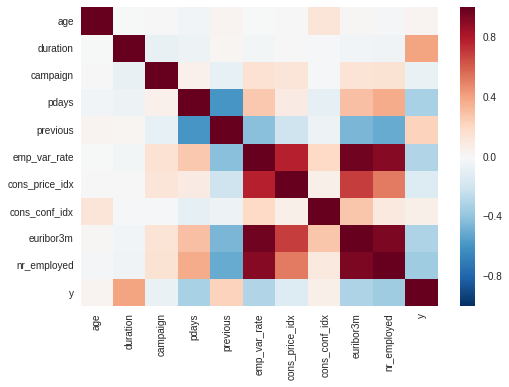
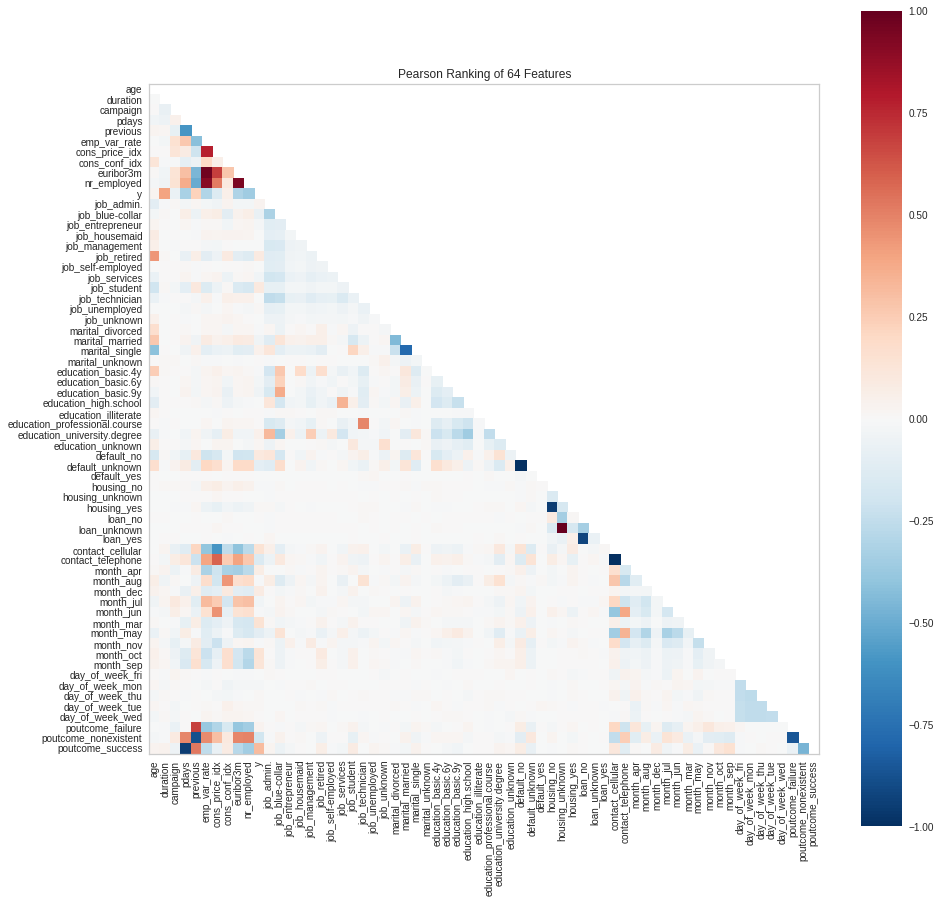

---
redirect_from:
  - "/lessons/lesson4-awsml-modeling"
interact_link: content/lessons/Lesson4_AWSML_Modeling.ipynb
kernel_name: python3
title: 'Lesson 4 - Amazon Machine Learning Modeling'
prev_page:
  url: /lessons/Lesson3_AWSML_Exploratory_Data_Analysis
  title: 'Lesson 3 - Amazon Machine Learning Exploratory Data Analysis'
next_page:
  url: /lessons/Lesson5_AWSML_Operationalization
  title: 'Lesson 5 - Amazon Machine Learning Operationalization'
comment: "***PROGRAMMATICALLY GENERATED, DO NOT EDIT. SEE ORIGINAL FILES IN /content***"
---

<a href="https://colab.research.google.com/github/noahgift/aws-ml-guide/blob/master/Lesson4_AWSML_Modeling.ipynb" target="_parent"></a>

# Lesson 4 Machine Learning Modeling on AWS

[Watch Lesson 4:  Machine Learning Modeling on AWS Video](https://learning.oreilly.com/videos/aws-certified-machine/9780135556597/9780135556597-ACML_01_04_00)

## Pragmatic AI Labs


This notebook was produced by [Pragmatic AI Labs](https://paiml.com/).  You can continue learning about these topics by:

*   Buying a copy of [Pragmatic AI: An Introduction to Cloud-Based Machine Learning](http://www.informit.com/store/pragmatic-ai-an-introduction-to-cloud-based-machine-9780134863863) from Informit.
*   Buying a copy of  [Pragmatic AI: An Introduction to Cloud-Based Machine Learning](https://www.amazon.com/Pragmatic-AI-Introduction-Cloud-Based-Learning/dp/0134863860) from Amazon
*   Reading an online copy of [Pragmatic AI:Pragmatic AI: An Introduction to Cloud-Based Machine Learning](https://www.safaribooksonline.com/library/view/pragmatic-ai-an/9780134863924/)
*  Watching video [Essential Machine Learning and AI with Python and Jupyter Notebook-Video-SafariOnline](https://www.safaribooksonline.com/videos/essential-machine-learning/9780135261118) on Safari Books Online.
* Watching video [AWS Certified Machine Learning-Speciality](https://learning.oreilly.com/videos/aws-certified-machine/9780135556597)
* Purchasing video [Essential Machine Learning and AI with Python and Jupyter Notebook- Purchase Video](http://www.informit.com/store/essential-machine-learning-and-ai-with-python-and-jupyter-9780135261095)
*   Viewing more content at [noahgift.com](https://noahgift.com/)


## Load AWS API Keys

Put keys in local or remote GDrive:  

`cp ~/.aws/credentials /Users/myname/Google\ Drive/awsml/`

### Mount GDrive


{:.input_area}
```
from google.colab import drive
drive.mount('/content/gdrive', force_remount=True)
```


{:.output .output_stream}
```
Mounted at /content/gdrive

```


{:.input_area}
```
import os;os.listdir("/content/gdrive/My Drive/awsml")
```


{:.output .output_data_text}
```
['kaggle.json', 'credentials', 'config']
```


### Install Boto


{:.input_area}
```
!pip -q install boto3

```


### Create API Config


{:.input_area}
```
!mkdir -p ~/.aws &&\
  cp /content/gdrive/My\ Drive/awsml/credentials ~/.aws/credentials 
```


### Test Comprehend API Call


{:.input_area}
```
import boto3
comprehend = boto3.client(service_name='comprehend', region_name="us-east-1")
text = "There is smoke in San Francisco"
comprehend.detect_sentiment(Text=text, LanguageCode='en')
```


{:.output .output_data_text}
```
{'ResponseMetadata': {'HTTPHeaders': {'connection': 'keep-alive',
   'content-length': '160',
   'content-type': 'application/x-amz-json-1.1',
   'date': 'Thu, 22 Nov 2018 00:21:54 GMT',
   'x-amzn-requestid': '9d69a0a9-edec-11e8-8560-532dc7aa62ea'},
  'HTTPStatusCode': 200,
  'RequestId': '9d69a0a9-edec-11e8-8560-532dc7aa62ea',
  'RetryAttempts': 0},
 'Sentiment': 'NEUTRAL',
 'SentimentScore': {'Mixed': 0.008628507144749165,
  'Negative': 0.1037612184882164,
  'Neutral': 0.8582549691200256,
  'Positive': 0.0293553676456213}}
```


## 4.1 AWS ML Systems Overview

### Machine Learning at AWS


* [AWS ML Services Video](https://www.aws.training/learningobject/video?id=16207&trk=gs_card)
* [AWS Machine Learning Overview Video](https://www.aws.training/learningobject/video?id=16363&trk=gs_card)

* Thousands of Engineers working on Machine Learning at AWS


#### What is Machine Learning?


*   Subset of AI
*   Deep Learning is subset of Machine Learning


#### What can Machine Learning Do?


* Make predictions
* Optimize utility functions
* Extract hidden data structures
* Classify data

#### Machine Learning Use Cases

##### Fraud Detection

  

  - Mine data
  - Identify hidden patterns and create labels (unsupervised learning)
  - Train model
  - Flag transaction as fraudulent
  

##### Content Personalization


  - Use predictive analytics to recommend items (recommendation systems)

##### Target Marketing

* Use custom activity to choose revelant email campaigns
* cross-selling
* upselling

##### Categorization

* Matching hiring managers and resumes
* Unstructured content --> Machine Learning Model --> Categorized documents

##### Customer Service

* Analyze social media traffic to route customers to customer support
* Predictive routing of customer emails

#### Machine Learning Concepts


**Combination of Methods and Systems**

* **Predict**
  - Predict new data based on observed data
* **Extract**
  - Extract hidden structure from data
* **Summarize**
  - Summarize data into executive brief
* **Optimize**
  - Optimize an action, given a cost function and observed data
* **Adapt**
  - Adapt based on observed data

#### Machine Learning Types


* Supervised Learning
  - Labels are known for inputs and outputs
  - Model "learns" to generalize from data (records)
  - Human needs to tell model which outputs are correct (to train model)
  - Input --> Model --> Output/Prediction
  - Classification (Category like "red", "blue") and Regression (Numerical i.e. Housing price)
 
* Unsupervised Learning
  - Labels are not known
  - Lables "hidden structures" are discovered
  - Self-organization
  - Clustering
 
* Reinforcement Learning
  - Model learns by interacting with environment
  - Learns to take action to maximize total reward
  - Inspired by behavioral biology
 
  
  

#### Frameworks & Infrastructure

* All Major frameworks
  - Apache MXNet
  - Caffe and Caffe 2
  - Tensorflow

#### Machine learning platforms

* Fully managed platform for building models with own data
  - Apache Spark on EMR
  - SparkML (25 PetaByte models, Zillow and Netflix) 
  - Sagemaker
  - Amazon Machine Learning

#### API-driven services

Examples include:


*   Comprehend (NLP)
*   Rekognition (Computer Vision)


#### Models

* Can be stored in S3
* Can be A/B tested

#### Optimized Instances & Machine Images

* Deep Learning AMIs
* Containers

## 4.2 Feature Engineering


### Feature Engineering Overview


*   Feature is an attribute used in a prediction model
*   Feature engineering is the creation and curation of these attributes


### Explore Features


{:.input_area}
```
import pandas as pd
import seaborn as sns

df = pd.read_csv("https://raw.githubusercontent.com/noahgift/aws-ml-guide/master/data/banking.csv")
df.head()
```


<div markdown="0" class="output output_html">
<div>
<style scoped>
    .dataframe tbody tr th:only-of-type {
        vertical-align: middle;
    }

    .dataframe tbody tr th {
        vertical-align: top;
    }

    .dataframe thead th {
        text-align: right;
    }
</style>
<table border="1" class="dataframe">
  <thead>
    <tr style="text-align: right;">
      <th></th>
      <th>age</th>
      <th>job</th>
      <th>marital</th>
      <th>education</th>
      <th>default</th>
      <th>housing</th>
      <th>loan</th>
      <th>contact</th>
      <th>month</th>
      <th>day_of_week</th>
      <th>...</th>
      <th>campaign</th>
      <th>pdays</th>
      <th>previous</th>
      <th>poutcome</th>
      <th>emp_var_rate</th>
      <th>cons_price_idx</th>
      <th>cons_conf_idx</th>
      <th>euribor3m</th>
      <th>nr_employed</th>
      <th>y</th>
    </tr>
  </thead>
  <tbody>
    <tr>
      <th>0</th>
      <td>44</td>
      <td>blue-collar</td>
      <td>married</td>
      <td>basic.4y</td>
      <td>unknown</td>
      <td>yes</td>
      <td>no</td>
      <td>cellular</td>
      <td>aug</td>
      <td>thu</td>
      <td>...</td>
      <td>1</td>
      <td>999</td>
      <td>0</td>
      <td>nonexistent</td>
      <td>1.4</td>
      <td>93.444</td>
      <td>-36.1</td>
      <td>4.963</td>
      <td>5228.1</td>
      <td>0</td>
    </tr>
    <tr>
      <th>1</th>
      <td>53</td>
      <td>technician</td>
      <td>married</td>
      <td>unknown</td>
      <td>no</td>
      <td>no</td>
      <td>no</td>
      <td>cellular</td>
      <td>nov</td>
      <td>fri</td>
      <td>...</td>
      <td>1</td>
      <td>999</td>
      <td>0</td>
      <td>nonexistent</td>
      <td>-0.1</td>
      <td>93.200</td>
      <td>-42.0</td>
      <td>4.021</td>
      <td>5195.8</td>
      <td>0</td>
    </tr>
    <tr>
      <th>2</th>
      <td>28</td>
      <td>management</td>
      <td>single</td>
      <td>university.degree</td>
      <td>no</td>
      <td>yes</td>
      <td>no</td>
      <td>cellular</td>
      <td>jun</td>
      <td>thu</td>
      <td>...</td>
      <td>3</td>
      <td>6</td>
      <td>2</td>
      <td>success</td>
      <td>-1.7</td>
      <td>94.055</td>
      <td>-39.8</td>
      <td>0.729</td>
      <td>4991.6</td>
      <td>1</td>
    </tr>
    <tr>
      <th>3</th>
      <td>39</td>
      <td>services</td>
      <td>married</td>
      <td>high.school</td>
      <td>no</td>
      <td>no</td>
      <td>no</td>
      <td>cellular</td>
      <td>apr</td>
      <td>fri</td>
      <td>...</td>
      <td>2</td>
      <td>999</td>
      <td>0</td>
      <td>nonexistent</td>
      <td>-1.8</td>
      <td>93.075</td>
      <td>-47.1</td>
      <td>1.405</td>
      <td>5099.1</td>
      <td>0</td>
    </tr>
    <tr>
      <th>4</th>
      <td>55</td>
      <td>retired</td>
      <td>married</td>
      <td>basic.4y</td>
      <td>no</td>
      <td>yes</td>
      <td>no</td>
      <td>cellular</td>
      <td>aug</td>
      <td>fri</td>
      <td>...</td>
      <td>1</td>
      <td>3</td>
      <td>1</td>
      <td>success</td>
      <td>-2.9</td>
      <td>92.201</td>
      <td>-31.4</td>
      <td>0.869</td>
      <td>5076.2</td>
      <td>1</td>
    </tr>
  </tbody>
</table>
<p>5 rows × 21 columns</p>
</div>
</div>


#### Correlation Heatmap


{:.input_area}
```
sns.heatmap(df.corr())
```


{:.output .output_data_text}
```
<matplotlib.axes._subplots.AxesSubplot at 0x7fd3ae31b4a8>
```


{:.output .output_png}



#### Yellowbrick Road Feature Rank

Can use [yellowbrick road](http://www.scikit-yb.org/en/latest/index.html) to visualize feature importance


{:.input_area}
```
from yellowbrick.features import Rank2D
visualizer = Rank2D(algorithm="pearson", size=(1080, 1080))
visualizer.fit_transform(pd.get_dummies(df))
visualizer.poof()
```


{:.output .output_png}



### Demo AWS Machine Learning Service


*  [Tutorial:  Amazon ML to Predict Reponses to a ML Offer](https://docs.aws.amazon.com/machine-learning/latest/dg/tutorial.html)

*   Create Training Datasource (Steps Below)


*   Prepare Data 
 ** - Create S3 Bucket & Create folder**
  
  
**  - Upload CSV files**


  
 
**  - Create Data Source **


**Infer the Schema**

Amazon Machine Learning Service infers the proper schema


**Select the Target**


## 4.3 Train a Model

#### Create 70/30 Split and Train Model in sklearn


{:.input_area}
```
banking_df = pd.read_csv("https://raw.githubusercontent.com/noahgift/aws-ml-guide/master/data/banking.csv")
banking_df.columns #y column will be predicted
```


{:.output .output_data_text}
```
Index(['age', 'job', 'marital', 'education', 'default', 'housing', 'loan',
       'contact', 'month', 'day_of_week', 'duration', 'campaign', 'pdays',
       'previous', 'poutcome', 'emp_var_rate', 'cons_price_idx',
       'cons_conf_idx', 'euribor3m', 'nr_employed', 'y'],
      dtype='object')
```


#### One Hot Encode with sklearn

[One Hot Encode Categories](https://scikit-learn.org/stable/modules/generated/sklearn.feature_extraction.DictVectorizer.html#sklearn.feature_extraction.DictVectorizer)


{:.input_area}
```
from sklearn.model_selection import train_test_split
from sklearn.linear_model import LogisticRegression
from sklearn.feature_extraction import DictVectorizer

dvec = DictVectorizer(sparse=False)
vectorized_banking_df = dvec.fit_transform(df.transpose().to_dict().values())
train, test = train_test_split(vectorized_banking_df, test_size=0.3)

print(f" 70% Split data structure: {type(train)} and shape: {train.shape}")
print(f" 30% Split data structure: {type(test)} and shape: {test.shape}")

```


{:.output .output_stream}
```
 70% Split data structure: <class 'numpy.ndarray'> and shape: (28831, 64)
 30% Split data structure: <class 'numpy.ndarray'> and shape: (12357, 64)

```

#### Use Logistic Regression to train model on 70% train data


{:.input_area}
```
from sklearn.linear_model import LogisticRegression

X = train[:,:-1]  #drop the predict 'y'
print(f" Drop last column in X {X.shape}")
Y = train[:, -1] #select only predict variable 'y'
print(f" Select last column in Y {Y.shape}")
model = LogisticRegression()
model.fit(X, Y)

```


{:.output .output_stream}
```
 Drop last column in X (28831, 63)
 Select last column in Y (28831,)

```


{:.output .output_data_text}
```
LogisticRegression(C=1.0, class_weight=None, dual=False, fit_intercept=True,
          intercept_scaling=1, max_iter=100, multi_class='warn',
          n_jobs=None, penalty='l2', random_state=None, solver='warn',
          tol=0.0001, verbose=0, warm_start=False)
```


### Demo AWS Machine Learning Service


*   [Tutorial (Continued): Amazon ML to Predict Reponses to a ML Offer](https://docs.aws.amazon.com/machine-learning/latest/dg/tutorial.html)

*   **Create ML Model**


## 4.4 Evaluate a Model

#### Classification Model Evaluation Metrics


* **Precision**

* **Recall**

* **F1**:  harmonic mean of precision and recall

* **AUC ([Area Under the Curve](https://docs.aws.amazon.com/machine-learning/latest/dg/binary-model-insights.html#measuring-ml-model-accuracy))**

Measures the ability of a model to predict higher scores for positive observations vs negative observations.


#### Using Yellowbrick road to evaluate model


{:.input_area}
```
from yellowbrick.classifier import ClassificationReport
from sklearn.linear_model import LogisticRegression

visualizer = ClassificationReport(model)
visualizer.fit(X, Y)
visualizer.score(X, Y)
visualizer.poof()
```


{:.output .output_png}


#### Generate Cross-Validated Precision and Recall


{:.input_area}
```
from sklearn.model_selection import cross_val_predict
from sklearn.metrics import precision_score, recall_score

y_train_pred = cross_val_predict(model, X, Y, cv=3)
```


**Precision**


{:.input_area}
```
precision_score(Y, y_train_pred)
```


{:.output .output_data_text}
```
0.6702619414483821
```


**Recall**


{:.input_area}
```
recall_score(Y, y_train_pred)
```


{:.output .output_data_text}
```
0.3987167736021998
```


**F1 Score**


{:.input_area}
```
from sklearn.metrics import f1_score
```


{:.input_area}
```
f1_score(Y, y_train_pred)
```


{:.output .output_data_text}
```
0.5000000000000001
```


**AUC**


{:.input_area}
```
from sklearn.metrics import roc_auc_score

roc_auc_score(Y, y_train_pred)
```


{:.output .output_data_text}
```
0.68679871859545
```


### Demo AWS Machine Learning Service


**Evaluatate Model**


**Explore Performance**


* Evaluating Model
* Explore Performance

## 4.5 Tune a Model

### [Demo] AWS Machine Learning Service

* show tradeoffs

## 4.6 Understand ML Inference

### [Demo] AWS Machine Learning Service

* Refers to prediction
* Sagemaker can auto-scale inference endpoints
* Also Amazon Elastic Inference service:
  - Can save up to 75% of cost of inference (predictions)
  - Attaches to Sagemaker and EC2

## 4.7 Understand Deep Learning

### Intro to Deep Learning

[Intro to Deep Learning on AWS Video](https://www.aws.training/learningobject/video?id=16439&trk=gs_card)

#### Brief History of Neural Networks

* 1950-1998:  Academic Activity
* 1998-2007:  AI Winter
* 2007-Today:  "The GPU Era" (Moore's law over 2005)
* Deep Learning is a "multi-layered" feed-forward neural network


#### Perform Storm for Deep Learning

* Cloud Computing
* End of Moore's Law (forces more GPU adoption)
* Elastic Storage and Compute
* Proliferation of data:  social networks, etc


#### What is a Neural Network?


* Can be "Deep" Neural Network (multi-layered), but optional
* Simple functions than be collectively trained (in layers) to learn complex functions
* Input Layer --> Hidden Layer(s) ---> Output Layer


* RNN is used sequences like:  
  - text
  - speech
  - translation 

#### Deep Learning Use Cases

* Text analysis (NLP)
  - insider trading
  - sentiment analysis
  - regulatory compliance
  - brand affinity
  - intent analysis
  
* Time Series
  - financial
  - log analysis
  - supply chain
  - IoT
 
* Recommendation Engines 
  - Social Meida

### Deep Learning AMIs


* Three Styles of Deep Learning AMIs
  - Conda-based AMI
  - Base AMI
  - AMIs with source code
* Available "Pay as you Go" (On Demand)
* Available "Spot Instance"
* Can perform ["Multi-GPU training"](https://docs.aws.amazon.com/dlami/latest/devguide/keras-mxnet.html)
* Preloaded with Frameworks


